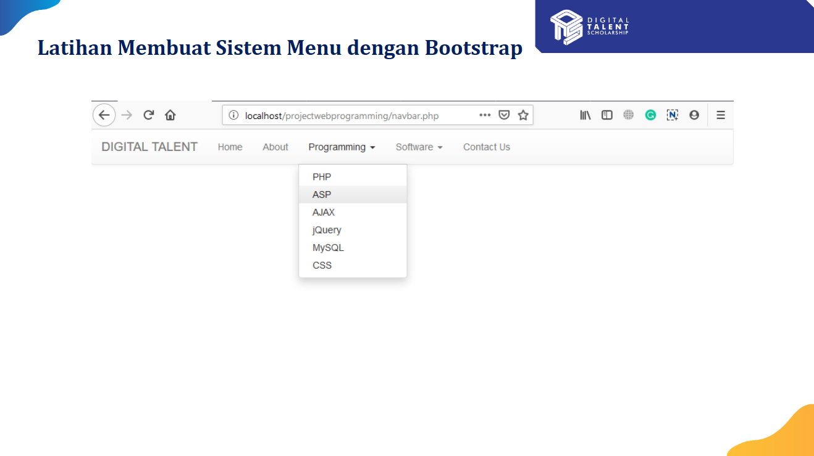
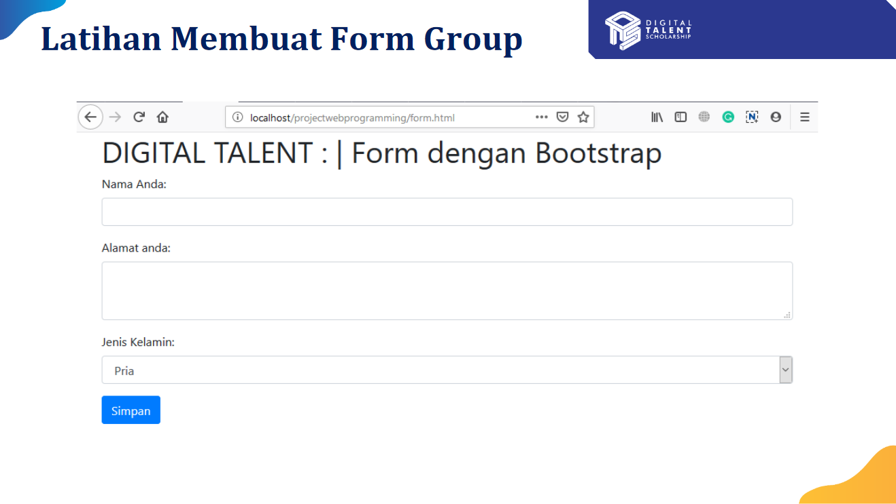
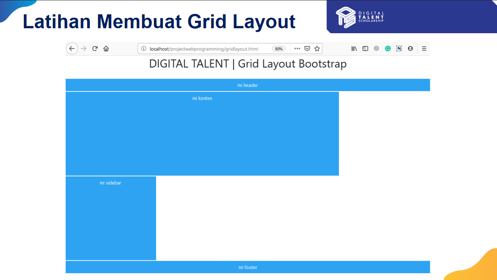

# Tugas 4
1. Membuat Sistem Menu dengan Bootstrap (Navbar)
2. Membuat Form Group dengan Bootstrap
3. Membuat Layout dengan Bootstrap

# Tugas Membuat UI
1. Sama seperti diatas, tapi disesuaikan dengan Tema Website yang dibuat

# Contoh
1. Navbar

2. Form Group

3. Layout dengan Bootstrap

